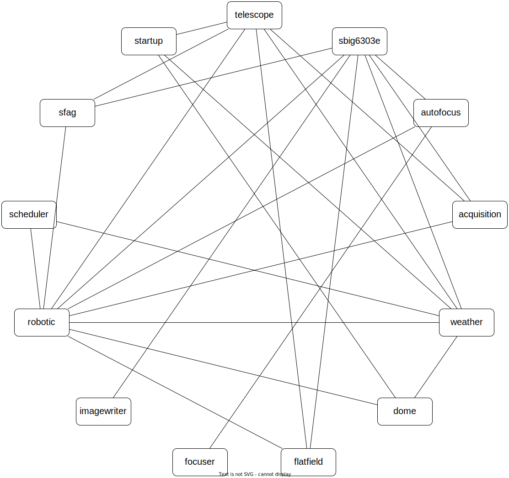

Configuration of the IAG 50cm
-----------------------------

This is the configuration for the 50cm telescope at the Institute for Astrophysics and Geophysics in Göttingen. See
`here <https://www.uni-goettingen.de/en/217812.html>`_ for more details.

The modules are distributed over two different computers, ``iag50srv`` and ``iag50cam``. Autoslew is used as the
telescope software and is running on a third computer, together with an
`ASCOM Alpaca Remote server <https://www.ascom-standards.org/Developer/Alpaca.htm>`_ for remote access.

All the configs are shown here without the ``comm`` part and the environment details.

iag50srv
^^^^^^^^

acquisition
"""""""""""
.. code-block:: YAML
  :linenos:

  class: pyobs.modules.pointing.Acquisition

  # modules
  telescope: telescope
  camera: sbig6303e
  filters: sbig6303e

  # image settings
  filter_name: Clear
  binning: 2
  exposure_time: 2

  # log file
  log_file: /pyobs/acquisition.csv

  # tolerances
  max_offset: 7200
  tolerance: 10

  pipeline:
    - class: pyobs.images.processors.detection.SepSourceDetection
    - class: pyobs.images.processors.astrometry.AstrometryDotNet
      url: ...
      radius: 5
    - class: pyobs.images.processors.offsets.AstrometryOffsets

  apply:
    class: pyobs.utils.offsets.ApplyRaDecOffsets
    max_offset: 7200

  vfs:
    class: pyobs.vfs.VirtualFileSystem
    roots:
      cache:
        class: pyobs.vfs.HttpFile
        download: http://localhost:37075/

* The :class:`~pyobs.modules.pointing.Acquisition` class is used for the acquisition module (line 1).
* It requires the name of the other modules to use, which are :ref:`telescope` for the telescope, :ref:`sbig6303e`
  for the camera and the same for module for the filter wheel, since it is integrated into the camera (lines 4-6).
* The camera settings for the acquisition images (lines 9-11).
* A log file where all the offsets from the acquisitions are stored, can be useful for checking the pointing model
  (line 14).
* Tolerances for the acquisiton: it succeeds if the telescope is closer than 10" to the target and fails if the offsets
  get larger than 7200".
* The pipeline defines steps performed on the images in order to get the offsets for the next step (lines 20-25):

  #. :class:`~pyobs.images.processors.detection.SepSourceDetection` detects sources in the image.
  #. :class:`~pyobs.images.processors.astrometry.AstrometryDotNet` performs the astrometric calibration using a local
     astrometry.net server.
  #. :class:`~pyobs.images.processors.offsets.AstrometryOffsets` uses the astronomy to calculate offsets for the next
     telescope move.

* The offsets are applied via :class:`~pyobs.utils.offsets.ApplyRaDecOffsets`. It fails if the total offset gets larger
  than 7200" (lines 27-29).
* Finally, a VFS is defined with a root ``cache`` that points to the :ref:`filecache` HTTP cache server (lines 31-36).

autofocus
"""""""""
.. code-block:: YAML
  :linenos:

  class: pyobs.modules.focus.AutoFocusSeries

  # modules
  camera: sbig6303e
  focuser: focuser
  filters: sbig6303e

  # use absolute focus values instead of offsets
  offset: False

  # camera settings
  filter_name: Clear
  binning: 2

  # use projected stars
  series:
    class: pyobs.utils.focusseries.ProjectionFocusSeries

  vfs:
    class: pyobs.vfs.VirtualFileSystem
    roots:
      cache:
        class: pyobs.vfs.HttpFile
        download: http://localhost:37075/

* The :class:`~pyobs.modules.focus.AutoFocusSeries` class is used for the auto focus module (line 1).
* It requires the name of the other modules to use, which are :ref:`focuser` for the focus unit, :ref:`sbig6303e`
  for the camera and the same for module for the filter wheel, since it is integrated into the camera (lines 4-6).
* The ``offset`` parameter defines, whether absolute focus values are used or offsets from a fixed value (line 9).
* Image settings (lines 12-13).
* The actual focus series is done using the helper class :class:`~pyobs.utils.focusseries.ProjectionFocusSeries`
  (lines 16-17).
* Finally, a VFS is defined with a root ``cache`` that points to the :ref:`filecache` HTTP cache server (lines 31-36).

dome
""""

filecache
"""""""""

flatfield
"""""""""

focuser
"""""""

imagewatcher
""""""""""""

imagewriter
"""""""""""

pointing
""""""""

robotic
"""""""

scheduler
"""""""""

sfag
""""

startup
"""""""

telegram
""""""""

telescope
"""""""""

weather
"""""""

iag50-cam
^^^^^^^^^

sbig6303e
"""""""""
