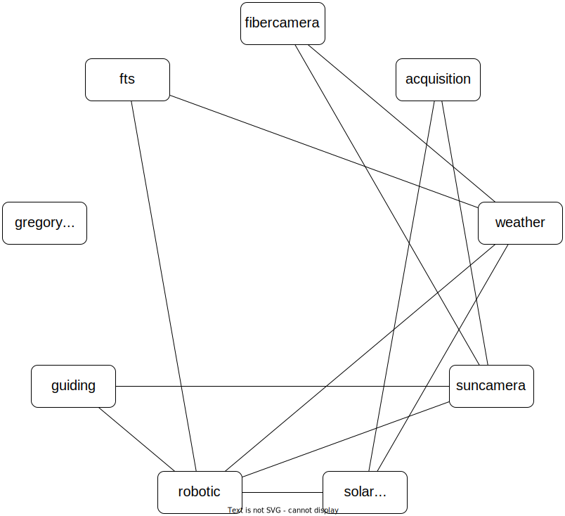

Configuration of the IAG VVT
----------------------------

This is the configuration for the Vacuum Vertical Telescope (VVT) at the Institute for Astrophysics and Geophysics in
Göttingen. See `here <https://www.uni-goettingen.de/en/217813.html>`_ for more details.

All the configs are shown here without the ``comm`` part and the environment details.

acquisition
"""""""""""
Module for performing a fine-acquisition on the sun

.. code-block:: YAML
  :linenos:

  class: pyobs.modules.pointing.Acquisition

  # modules
  telescope: solartelescope
  camera: suncamera

  # loging
  log_file: /pyobs/acquisition.csv

  # camera setting
  exposure_time: 0.02

  # tolerances
  max_offset: 7200
  tolerance: 10
  attempts: 10

  pipeline:
    - class: pyobs_iagvt.diskoffset.DiskOffset
    - class: pyobs_iagvt.sunexptime.SunExpTimeEstimator

  apply:
    class: pyobs_iagvt.applyoffsets.ApplySiderostatOffsets

  vfs:
    class: pyobs.vfs.VirtualFileSystem
    roots:
      cache:
        class: pyobs.vfs.HttpFile
        download: http://localhost:37075/

* The :class:`~pyobs.modules.pointing.Acquisition` class is used for the acquisition module (line 1).
* It requires the name of the other modules to use, which are :ref:`solartelescope` for the telescope and
  :ref:`suncamera` for the camera (lines 4-5).
* A log file where all the offsets from the acquisitions are stored, can be useful for checking the pointing model
  (line 8).
* The (initial) exposure time for the camera (line 11).
* Tolerances for the acquisiton: It succeeds if the telescope is closer than 10" to the target position on the sun.
  It fails if the offsets get larger than 7200". 10 moves are allowed (lines 14-16).
* The pipeline defines steps performed on the images in order to get the offsets for the next step (lines 18-20):

  #. ``DiskOffset`` is a custom class that takes the WCS from the :ref:`suncamera` and calculates offsets to go
     to the requested position.
  #. ``SunExpTimeEstimator`` is a custom class that tries to estimate a best exposure time for the next image.

* The offsets are applied via ``ApplySiderostatOffsets``, a custom class for offsetting the :ref:`solartelescope`
  (lines 22-23).
* Finally, a VFS is defined with a root ``cache`` that points to the :ref:`filecache` HTTP cache server
  and is used for downloading the images from the :ref:`suncamera` (lines 25-30).

fibercamera
"""""""""""
Module for operating the camera looking at the mirror with the two fiber holes

.. code-block:: YAML
  :linenos:

  class: pyobs_iagvt.fibercamera.FiberCamera
  device: The Imaging Source Europe GmbH-DMK ...

  # hole positions
  centre: [ 1265.0, 1050.0 ]
  fiberholes: [[1265.0, 1050.0], [1215.0, 1085.0]]

  # rotation E of N, and flip
  rotation: -97.07
  flip: True

  # plate scale
  plate_scale: 0.0005746363 # deg/px

  # filenames
  filenames: /fibercamera/pyobs-{DAY-OBS|date:}-{FRAMENUM|string:04d}.fits
  video_path: /fibercamera/video.mjpg

  # SIP calibration
  calibration_image: ...

  # camera settings
  buffers: 5
  settings:
    Gain: 0
    BlackLevel: 0
    FPS: 2

* ``FiberCamera`` is a class derived from :class:`pyobs_aravis.araviscamera.AravisCamera` with some extensions.
* The fiber hole and gregory hole are defined and one is also defined as the image center (lines 5-6).
* The rotation of the camera is given and whether that the image should be flipped (lines 9-10).
* The plate scale is given (line 13).
* URLs for FITS files and the video stream are defined (lines 16-17).
* A SIP calibration is given to be added to the WCS of the FITS file (line 20).
* Some camera settings are defined (lines 23-27).

filecache
"""""""""
Module used for distributing images among the other modules

.. code-block:: YAML
  :linenos:

  class: pyobs.modules.utils.HttpFileCache
  hostname: iagvtsrv
  port: 37075

* :class:`~pyobs.modules.utils.HttpFileCache` provides a HTTP server that can be used for distributing files (line 1).
* It needs a host and port to run on (line 3).

filewatcher
"""""""""""
Module for copying new images into the archive

.. code-block:: YAML
  :linenos:

  class: pyobs_iagvt.filewatcher.FileWatcher

  # watch settings
  watchpath: /ftscontrol/Local_Storage/
  pattern: "*.fits"
  poll: True
  poll_interval: 30

  # copy instructions
  wait_time: 10
  destinations:
  - /archive/{DAY-OBS}/{FNAME}

  vfs:
    class: pyobs.vfs.VirtualFileSystem
    roots:
      ftscontrol:
        class: pyobs.vfs.LocalFile
        root: /path/to/data/
      archive:
        class: pyobs.vfs.LocalFile
        root: /path/to/archive/

* ``FileWatcher`` is just an extension of :class:`pyobs.modules.image.imagewatcher.ImageWatcher`, which copies a few
  extra files (line 1).
* The path and files to watch are defined as well as that it should be polled every 10 seconds (lines 4-7).
* A single destination for the files is defined, where they should be copied 10 seconds after first discovery
  (lines 10-12).
* A VFS is used both for the watched directory and the destination path.

fts
"""
Module for operating the Fourier Transform Spectrograph (FTS)

.. code-block:: YAML
  :linenos:

  class: pyobs_iagvt.fts.FTS
  ...

* ``FTS`` is a class deriving from :class:`pyobs.modules.camera.basespectrograph.BaseSpectrograph` to implement
  the functionality of the spectrograph (line 1).
* The rest of the config is omitted here, since this class is not freely accessible.

gregorycamera
"""""""""""""
Module for operating a camera that looks at the gregory hole of the :ref:`fibercamera`.

.. code-block:: YAML
  :linenos:

  class: pyobs_iagvt.gregorycamera.GregoryCamera

  # aravis
  device: The Imaging Source Europe GmbH-DFK 23GP031-50410119

  # paths
  filenames: /gregorycamera/pyobs-{DAY-OBS|date:}-{FRAMENUM|string:04d}.fits
  video_path: /gregorycamera/video.mjpg
  http_port: 37078

  # camera
  buffers: 5
  settings:
    Gain: 0
    BlackLevel: 0
    FPS: 2

* ``GregoryCamera`` is a class derived from :class:`pyobs_aravis.araviscamera.AravisCamera` with some extensions
  (line 1).
* The Aravis device name is given (line 4).
* Paths to FITS files and video stream are given as well as the used port (lines 7-9).
* Some camera settings are defined (lines 12-16).

guiding
"""""""
Module for guiding on a given position on the sun

.. code-block:: YAML
  :linenos:

  class: pyobs.modules.pointing.AutoGuiding

  # modules
  telescope: solartelescope
  camera: suncamera

  # tolerances
  exposure_time: 0.01
  min_interval: 5

  pipeline:
    - class: pyobs_iagvt.diskoffset.DiskOffset
    - class: pyobs_iagvt.sunexptime.SunExpTimeEstimator

  apply:
    class: pyobs_iagvt.applyoffsets.ApplySiderostatOffsets
    min_offset: 2
    max_offset: 30
    log_file: /pyobs/guiding.csv

  vfs:
    class: pyobs.vfs.VirtualFileSystem
    roots:
      cache:
        class: pyobs.vfs.HttpFile
        download: http://localhost:37075/
      fibercamera:
        class: pyobs.vfs.HttpFile
        download: http://localhost:37077/

* The class :class:`~pyobs.modules.pointing.AutoGuiding` performs auto-guiding on images of the :ref:`suncamera`
  (line 1).
* It requires the names of the telescope (:ref:`solartelescope`) and the camera (:ref:`suncamera`) modules (lines 4-5).
* The initial exposure time of images to use for auto-guiding is defined as well as a min interval in seconds
  between offsets (lines 8-9).
* The pipeline is defined to calculate offsets, in this case based on (lines 11-13):

  #. ``DiskOffset`` is a custom class that takes the WCS from the :ref:`suncamera` and calculates offsets to go
     to the requested position.
  #. ``SunExpTimeEstimator`` is a custom class that tries to estimate a best exposure time for the next image.

* The offsets are applied via ``ApplySiderostatOffsets``, a custom class for offsetting the
  :ref:`solartelescope` (lines 15-19).
* Finally, a VFS is defined with a root ``cache`` that points to the :ref:`filecache` HTTP cache server
  and is used for downloading the images from the :ref:`suncamera` (lines 21-29).

robotic
"""""""
Module for running full roboric operations

.. code-block:: YAML
  :linenos:

  class: pyobs_iagvt.solarmastermind.SolarMastermind

  schedule:
    class: pyobs_iagvt.taskschedule.VTTaskSchedule
    ...

  runner:
    class: pyobs.robotic.TaskRunner
    scripts:
      EXPOSE:
        class: pyobs_iagvt.defaultscript.VTDefaultScript
        telescope: solartelescope
        fts: fts
        acquisition: acquisition
        autoguider: guiding

* ``SolarMastermind`` is a custom class that combines the task runner and the scheduler in one class (line 1).
* The schedule is calculated using the custom class ``VTTaskSchedule`` (line 3-5).
* A task runner is defined which runs a custom script (lines 7-15).

solartelescope
""""""""""""""
Module for operating the siderostat

.. code-block:: YAML
  :linenos:

  class: pyobs_iagvt.solartelescope.SolarTelescope

* ``SolarTelescope`` is a custom telescope class, inheriting from
  :class:`pyobs.modules.telescope.basetelescope.BaseTelescope`, but it also implements
  :class:`pyobs.interfaces.IPointingHGS.IPointingHGS` to be able to move to Heliographic Stonyhurst coordinates.

suncamera
"""""""""
A module for a virtual camera that adds a correct WCS to images from :ref:`fibercamera`

.. code-block:: YAML
  :linenos:

  class: pyobs_iagvt.suncamera.SunCamera
  flatfield: /opt/pyobs/storage/flatfield.npy

  vfs:
    class: pyobs.vfs.VirtualFileSystem
    roots:
      cache:
        class: pyobs.vfs.HttpFile
        upload: http://localhost:37075/
      fibercamera:
        class: pyobs.vfs.HttpFile
        download: http://localhost:37077/

* ``SunCamera`` is not much more than a proxy, forwarding all calls to :ref:`fibercamera`. But it also uses a disk
  detection to add a correct WCS to the images (line 1).
* A flat-field to use for the calibration is given (line 2).
* A VFS is used to grab images from :ref:`fibercamera` and publish new images with the WCS (lines 4-12).

weather
"""""""
.. code-block:: YAML
  :linenos:

  class: pyobs.modules.weather.Weather
  url: ...

* In this case, the :class:`~pyobs.modules.weather.Weather` class is used, which connects to a running instance of
  `pyobs-weather <https://docs.pyobs.org/projects/pyobs-weather/en/latest/>`_ (lines 1-2).